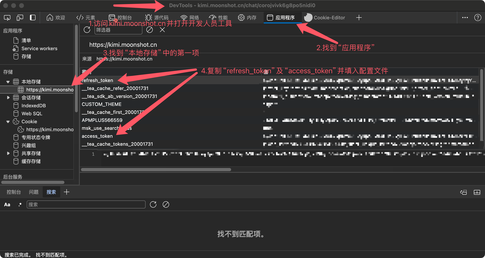

# revKimi

[](https://pypi.python.org/pypi/revKimi)

kimi逆向api

## 安装
```bash
pip install revKimi --upgrade
```

## 使用
具体用法可查看方法`Type Hint`

## 1.初始化

### 配置文件可由以下两种方式提供：

#### 1. 使用默认的文件对象，只需传入`file_path`
```python
from revKimi import Chatbot

chatbot = Chatbot(config_path="./config.json")
```
`file_path`为JSON配置文件路径，若不填则默认"./config.json"，若无配置文件会自动创建
**配置参数寻找方法如下图**


#### 2. 使用配置文件对象，需在`config`参数传入自己的文件对象，传入文件对象须实现`__getitem__`和`__setitem__`方法

```python
from revKimi import Chatbot

chatbot = Chatbot(config=config)
```

## 2.提问
```python
resp = chatbot.ask(
    prompt="你好", # 提问内容
    conversation_id=<conversation_id>,# 会话ID（不填则会新建）
    timeout=<timeout>,# 超时时间（默认10秒
use_search = False,  # 是否使用搜索
file = None,  # 文件二进制数据（传入代表上传文件）
)
```

### 文件上传说明

请求中的`file`参数为上传文件的二进制数据，可通过如下方法获取：

```python
with open("test.txt", "rb") as f:
    file = f.read()
```

# 响应示例
resp = {
    'conversation_id': 'coroksr5cfui11n4gql0', 
    'text': '你好！很高兴和你交流。有什么我可以帮你的吗？'
}
```

### 3.新建会话
```python
resp = chatbot.create_conversation([name])
```

### 4.删除会话
```python
chatbot.delete_conversation(<conversation_id>)
```

### 5.获取会话列表
```python
resp = chatbot.get_conversations([size])
```

### 6.获取会话历史
```python
resp = chatbot.get_history(<conversation_id>, [last])
```
